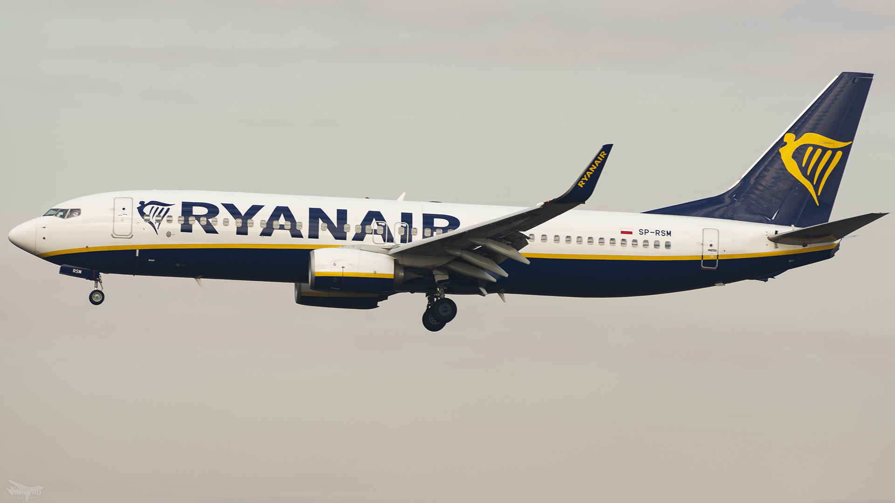
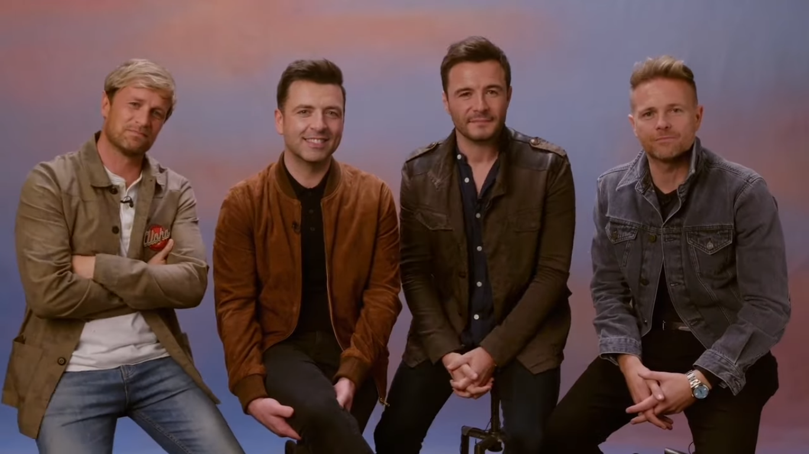

## Why?

- General speech science goals: how do people speak?
- Path towards better training materials, iterative training processes
- _SweTerror: multidisciplinary investigation into parliamentary discourse around the topic of terrorism_

---

## Fun personal fact:

- I come from Ireland, home of what used to be the world’s best known terrorist organisation.

---

##

###### KonradWyszyskiPlanespotting, CC BY 2.0 <https://creativecommons.org/licenses/by/2.0>, via <a href="https://commons.wikimedia.org/wiki/File:Ryanair_B738_SP-RSM.png">Wikimedia Commons</a>

---

## Boyzone

###### Rach, CC BY 2.0 <https://creativecommons.org/licenses/by/2.0>, via <a href="https://commons.wikimedia.org/wiki/File:Boyzone.jpg">Wikimedia Commons</a>

---

## Westlife

###### Warner Music New Zealand, CC BY 3.0 <https://creativecommons.org/licenses/by/3.0>, via <a href="https://commons.wikimedia.org/wiki/File:Westlife_2021_Warner_Music_New_Zealand.png">Wikimedia Commons</a>

